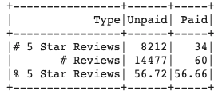

# Amazon_Vine_Analysis
Using Pyspark, AWS, S3, and PostgresSQL to analyze customer reviews from Amazon datasets

## Overview
The purpose of this analysis is to evaluate Amazon customer reviews for musical instruments, and look at the efficacy of the Vine program, where reviewers are compensated for their reviews. I wanted to determine if paying a reviewer had any effect on whether or not they gave the product five stars, or less than 5 stars. I obtained data from an Amazon S3 bucket that catalogues reviews specifically for musical instruments, then used Pyspark to extract, transform and load the data to a Postgres server to be stored. Amazon's reviews are structured uniformly in column names and types, so this analysis could be reused for other category analyses with minimal refactoring, only changing the S3 address that the program extracts the data from. The initial ETL process for cleaning and sorting the data can be found in the Amazom_Reviews_ETL.ipynb file, while the analysis of the Vine program can be found in the Vine_Review_Analysis.ipynb file. 

## Results

The initial dataframe that I created with Spark had numerous columns that were not needed for this analysis, so I selected only columns related to numerical ratings related to the purchase. This included the customer's rating from 1-5 stars, the number of votes that the review received as being helpful by other users, and the total number of votes that the review received. I only wanted to analyze reviews that received at least 20 review votes, as low-voted reviews would skew the data and analysis. So to be included, a post must have at least 20 votes, helpful or unhelpful by other reviewers. Next, I wanted to only include reviews where over 50% of other users voted them as helpful. This minimizes the effects of poorly written/unuseful reviews. Now that I had selected out reviews that were overall poorly received by other users, I separated out the posts that were paid and those that were unpaid. A summary dataframe of the results of the Vine analysis can be found below:

As we see in the summary, there were 14,477 unpaid reviews and 60 paid reviews that fit the criteria described in the previous paragraph. This creates a large disparity in sample size between the two groups that should be noted. As a percentage of 5 star reviews to total reviews, adjusted for scale, both groups had approximately the same performance, coming in around 56.6%. 

## Summary
Based off the analysis, there does not appear to be any positivity bias towards reviews in the Vine program. Paid and unpaid reviewers provided 5 star reviews at the same rate. However, it should of course be noted the large difference in sample sizes. There were only 60 paid reviews in this sample. It may be possible that in my initial data cleaning, I selected out paid reviews that could have had a small number of votes, or of those, were generally marked as unhelpful. This also presents an interesting question, as I would think that compensating a reviewer would lead to a higher quality review, even if their rating is not favorable to the product. One area that might require further analysis is to determine the effect not on 5 star vs. not 5 star, but to look at the incremental changes that each star rating incurs. A 4 star review is still generally favorable, but in this analysis it was treated the same as a one star review. This creates some overall uncertainty about the exact strength of compensating reviewers. 